# Mermaid Diagram Test

This document demonstrates various types of Mermaid diagrams.

## Flowchart

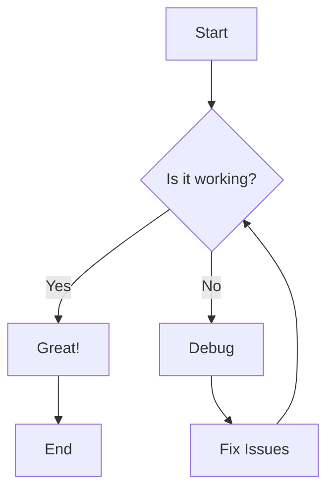

## Sequence Diagram

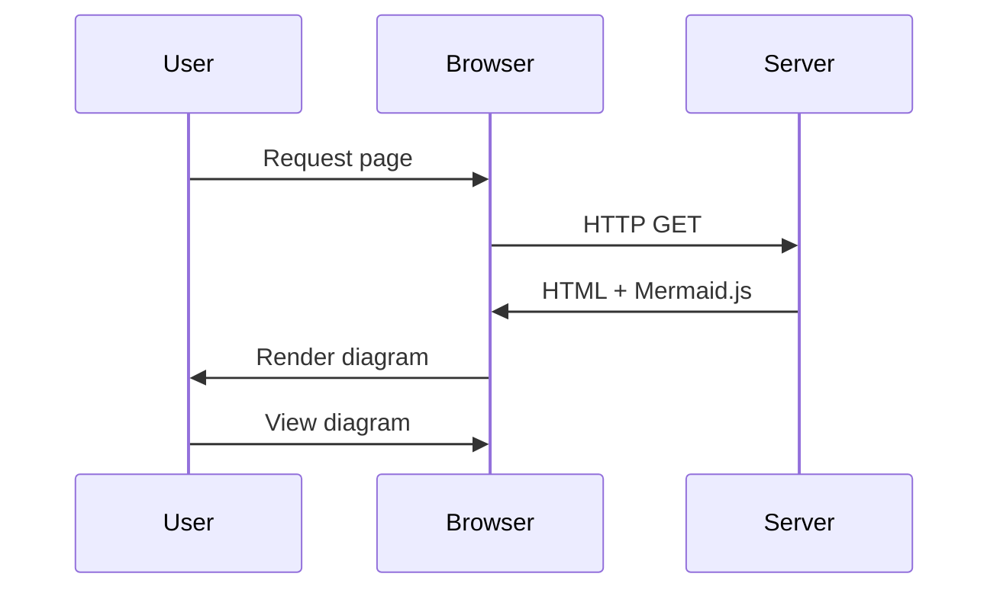

## Gantt Chart

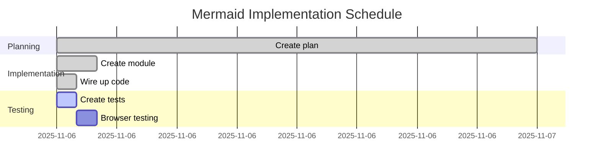

## Class Diagram

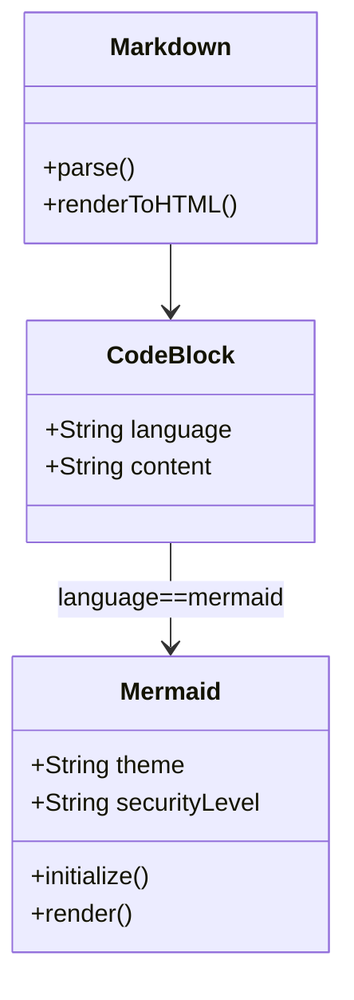

## State Diagram

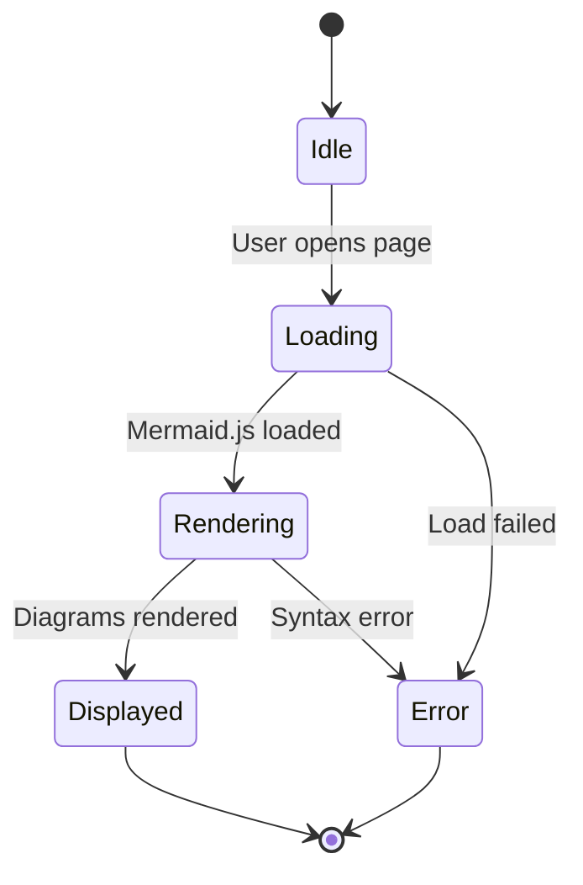

## Pie Chart

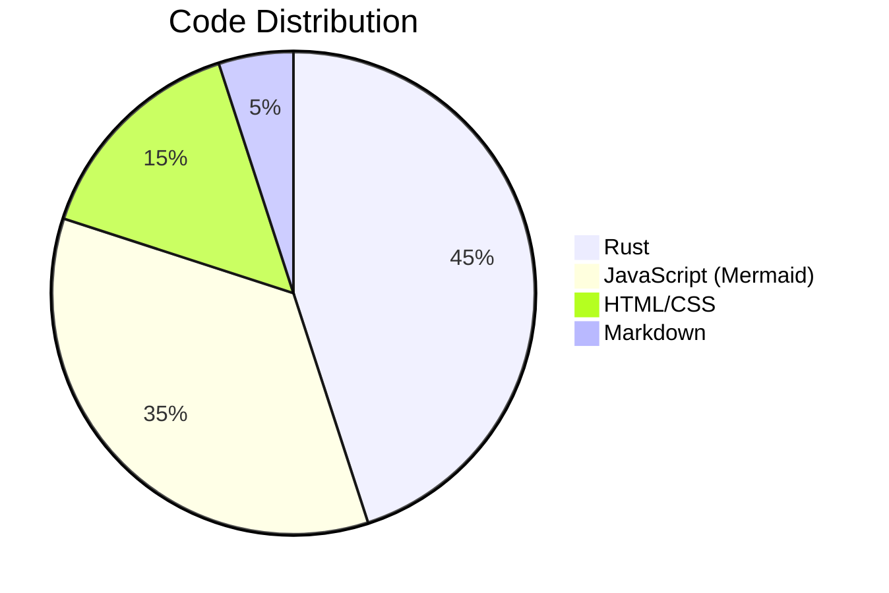

## Entity Relationship Diagram

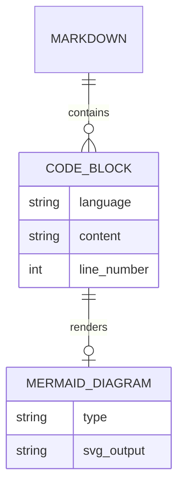

## User Journey

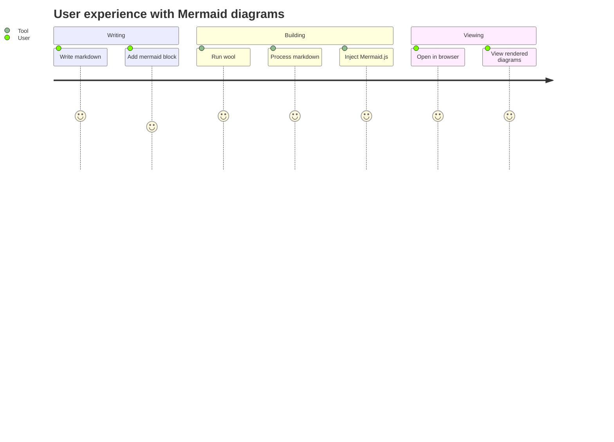

## Mixed Content

Regular markdown content can coexist with Mermaid diagrams.

Here's some **bold text** and *italic text*.

- List item 1
- List item 2
- List item 3

And here's another diagram:

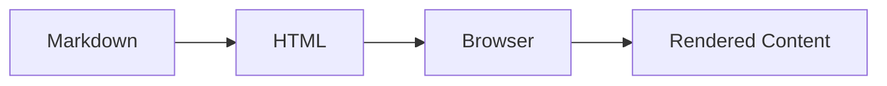

Regular code blocks still work fine:

```rust
fn main() {
    println!("Hello, world!");
}
```

```python
def greet(name):
    return f"Hello, {name}!"
```

## Edge Cases

### Empty Diagram Block

```mermaid
```

### Invalid Syntax (should show error)

```mermaid
this is not valid mermaid syntax
```

### Multiple Diagrams Side by Side

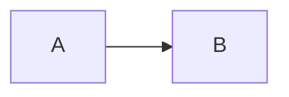

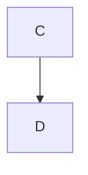

## Conclusion

This test file demonstrates that Mermaid diagrams integrate seamlessly with standard Markdown content.
