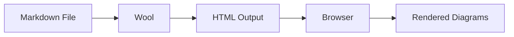
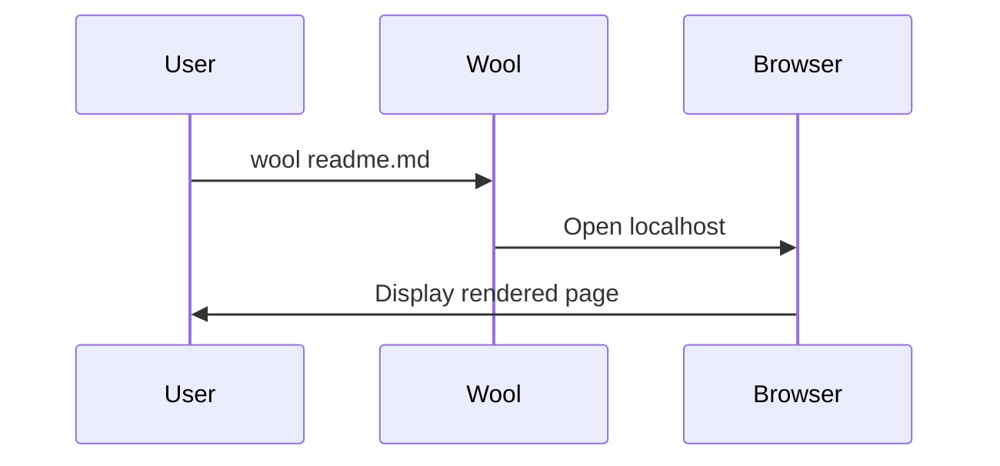
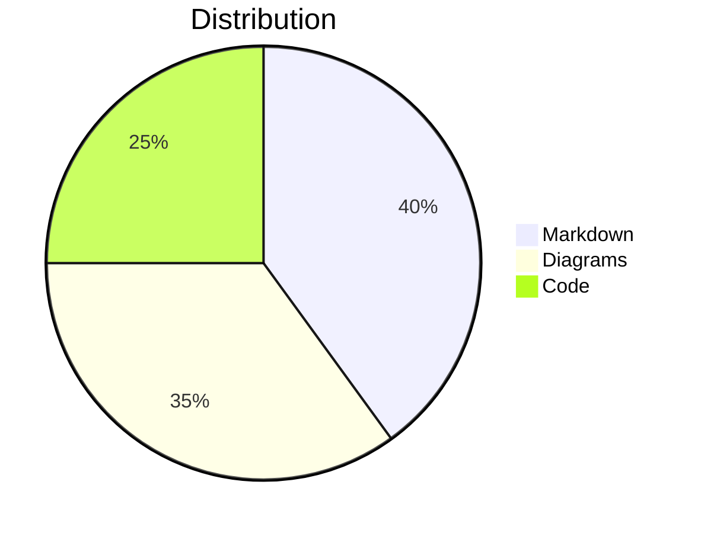

# wool

Extensible [grip](https://github.com/joeyespo/grip) clone

## Usage
```
USAGE:
    wool [FLAGS] <infile> [outfile]

FLAGS:
    -b, --browser             open in browser
    -e, --export              export html
    -h, --help                Prints help information
    -s, --highlight           syntax highlighting
    -n, --no-preview-frame    Don't render the preview frame
    -V, --version             Prints version information

ARGS:
    <infile>     Sets the input file to use
    <outfile>    Sets the output file to use
```

#### Example

preview on localhost:   
`wool readme.md` 

export to html:    
`wool readme.md --export mypreview.html`

###### Experimental

Syntax highlighting:
`wool readme.md -s`

## Mermaid Diagram Support

Wool supports inline Mermaid diagrams. Simply use code blocks with the `mermaid` language tag:

### Flowchart Example



### Sequence Diagram



### Simple Chart



For more examples, see [mermaid-test.md](mermaid-test.md) which includes:
- Flowcharts and sequence diagrams
- Gantt charts and timelines
- Class and ER diagrams
- State machines and user journeys
