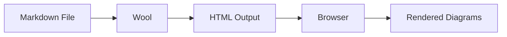
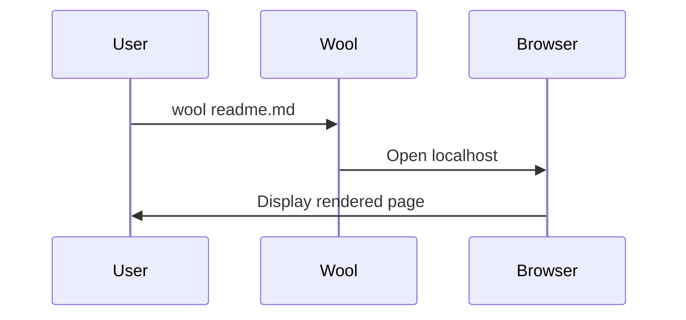
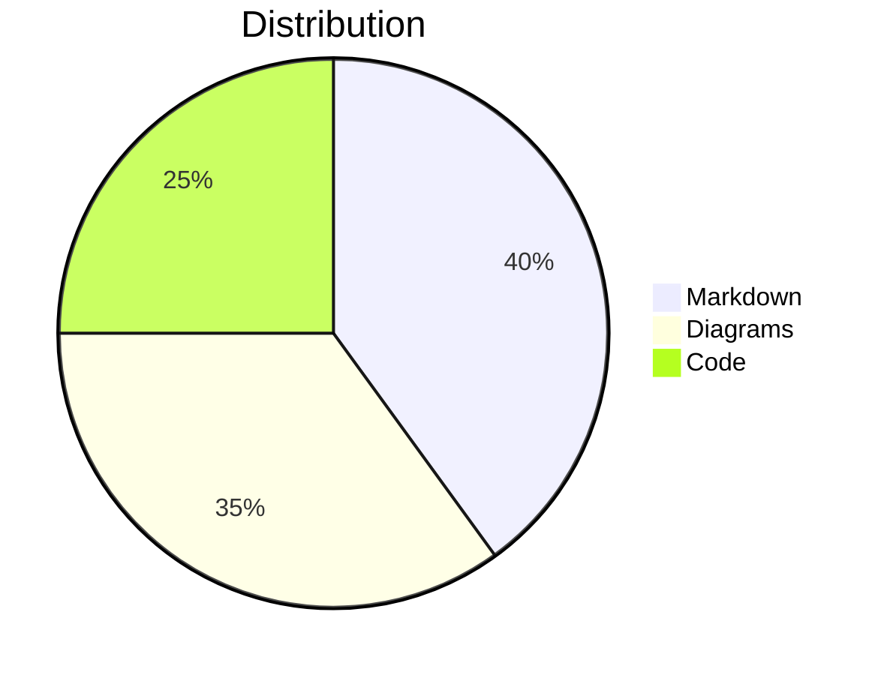

# wool - Feature Examples

Extensible [grip](https://github.com/joeyespo/grip) clone with support for equations, syntax highlighting, and diagrams.

## Usage
```
USAGE:
    wool [FLAGS] <infile> [outfile]

FLAGS:
    -b, --no-browser          Don't open browser (browser opens by default)
    -d, --d2                  Render inline D2 diagrams (requires d2 command)
    -e, --export              Export html
    -h, --help                Prints help information
    -s, --highlight           Syntax highlighting
    -k, --katex               Include katex in rendering
    -n, --no-preview-frame    Don't render the preview frame
    -V, --version             Prints version information

ARGS:
    <infile>     Sets the input file to use
    <outfile>    Sets the output file to use
```

## Features

### Tables

| Feature | Status | Flag |
|---------|--------|------|
| Tables | ✓ | (default) |
| Strikethrough | ✓ | (default) |
| Footnotes | ✓ | (default) |
| Task Lists | ✓ | (default) |
| Syntax Highlighting | ✓ | `-s` |
| KaTeX Math | ✓ | `-k` |
| D2 Diagrams | ✓ | `-d` |

### Code Blocks with Syntax Highlighting

Use the `-s` flag to enable syntax highlighting:

```python
def fibonacci(n):
    """Calculate the nth Fibonacci number."""
    if n <= 1:
        return n
    return fibonacci(n-1) + fibonacci(n-2)
```

### Math Equations with KaTeX

Use the `-k` flag to enable KaTeX rendering:

Inline math: $E = mc^2$

Block math:

$$
\frac{-b \pm \sqrt{b^2 - 4ac}}{2a}
$$

### Mermaid Diagram Support

Wool supports inline Mermaid diagrams. Simply use code blocks with the `mermaid` language tag:

#### Flowchart Example



#### Sequence Diagram



#### Simple Chart



For more examples, see [mermaid-test.md](mermaid-test.md) which includes:
- Flowcharts and sequence diagrams
- Gantt charts and timelines
- Class and ER diagrams
- State machines and user journeys

### D2 Diagrams

**Note:** D2 diagram rendering requires the [d2](https://d2lang.com) command to be installed on your system.

Use the `-d` flag to enable D2 diagram rendering:

```d2
# Simple connection diagram
x -> y: hello
y -> z: world
```

```d2
# Architecture diagram
direction: right

users: Users {
  shape: person
}

api: API Gateway {
  shape: rectangle
}

backend: Backend Service {
  shape: cylinder
}

db: Database {
  shape: cylinder
}

users -> api: HTTP Requests
api -> backend: Forward Requests
backend -> db: Query/Update
db -> backend: Results
backend -> api: Response
api -> users: HTTP Response
```

```d2
# Sequence diagram
shape: sequence_diagram

user: User
app: Application
db: Database

user -> app: Request data
app -> db: Query
db -> app: Results
app -> user: Response
```

## Examples

preview on localhost:
`wool examples/readme.md`

export to html:
`wool examples/readme.md --export mypreview.html`

with all features enabled:
`wool examples/readme.md -d -k -s`
