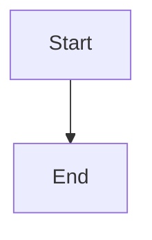

# wool
Extensible [grip](https://github.com/joeyespo/grip) clone with live preview, syntax highlighting, math rendering, and diagram support.

## Features

- **Live Preview**: GitHub-flavored markdown with auto-reload on file changes
- **Syntax Highlighting**: Prism.js support for code blocks (enabled by default)
- **Math Rendering**: KaTeX support for LaTeX equations (enabled by default)
- **D2 Diagrams**: Inline SVG rendering from D2 code blocks (enabled by default, requires [d2](https://d2lang.com))
- **Mermaid Diagrams**: Automatic rendering of Mermaid code blocks (always enabled)
- **Multiple Instances**: Automatic port detection (ports 10009-10018) allows running multiple previews
- **Browser Integration**: Automatically opens browser on startup
- **Static Files**: Images and assets served relative to markdown file location

## Installation

`cargo install wool`

## Usage
```
USAGE:
    wool [FLAGS] <infile> [outfile]

FLAGS:
    -e, --export              Export html
    -h, --help                Prints help information
    -b, --no-browser          Don't open browser (browser opens by default)
        --no-d2               Disable D2 diagram rendering (enabled by default)
        --no-highlight        Disable syntax highlighting (enabled by default)
        --no-katex            Disable KaTeX math rendering (enabled by default)
    -n, --no-preview-frame    Don't render the preview frame
    -V, --version             Prints version information

ARGS:
    <infile>     Sets the input file to use
    <outfile>    Sets the output file to use
```

## Examples

#### Basic preview
Opens browser automatically with all features enabled (syntax highlighting, KaTeX, D2, Mermaid):
```bash
wool readme.md
```

#### Preview without browser
```bash
wool readme.md --no-browser
```

#### Export to HTML
```bash
wool readme.md --export mypreview.html
```

#### Disable specific features
```bash
# Disable KaTeX math rendering
wool readme.md --no-katex

# Disable syntax highlighting
wool readme.md --no-highlight

# Disable D2 diagrams
wool readme.md --no-d2

# Disable multiple features
wool readme.md --no-katex --no-d2
```

## Diagram Support

### D2 Diagrams
Create diagrams using [D2](https://d2lang.com) syntax in code blocks:

````markdown
```d2
x -> y: hello world
```
````

### Mermaid Diagrams
Create diagrams using Mermaid syntax in code blocks:

````markdown

````

<!--
## Installation Options

Cargo: 
`cargo install wool`

Arch: 
`pacman -S wool`
-->
